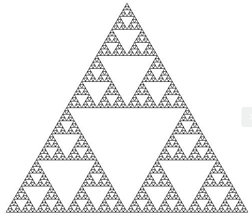

# Lindenmayer Systems

This repo contains code that emulates the properties of lindenmayer systems. You can use it to simply setup a grammar and apply rules on strings and also draw the resultant pattern/fractal constrained by the alphabet. 

## What is an L-system?

An L-system is a type of formal grammar that consists of (like most formal grammars):

- An alphabet (set of symbols )
- A set of production rules of the form 
- An axiom (the initial string from which construction starts)
- A mapping from the alphabet to geometric structures

This project used the following mapping from the alphabet space to geometric space:

- **F** - move forward 1 unit
- **+** - turn right 1 unit
- **-** - turn left 1 unit
- **B** - move backward 1 unit
- **[** - push the current state of the drawing tool onto a stack
- **]** - pop the previously pushed state of the drawing tool

## Usage

In order to use the code, your system must have python3, the turtle and PIL packages. Turtle is used to convert the strings into geometric patterns and PIL is used to save the drawn images in png form. 

To run the code only 2 files are needed, `[lSystem.py](lsystem.py)` and `[main.py](main.py)`, simply run the command `python3 main.py` and your generated pattern should be saved. 

### Changing the pattern

In order for the L-system to function properly, it has to be supplied the axiom and a ruleset (the alphabet and mapping are fixed). These parameters are passed to the class through its constructor, `axiom` can be passed as a string and `ruleset` a dictionary of lists of rules. 

**The ruleset**

The rule class is a representation of a single conversion rule that consists of a destination string and a probability value (for stochastic L-systems). Let us say we have the following rule:


This would look like `ruleF = [Rule('F+F-F+F', 1.0)]` in code form. If multiple rules are required (ensure that the probabilities sum to 1 in this case), they can be appended to the list. 

The ruleset is a mapping from input characters to lists of rules and would look something like this: `ruleset = {'F':ruleF}`. 

```jsx
from lSystem import *

axiom = 'F+F+F+F'

ruleF = [Rule('FF+F-F+F+FF', 1.0)]
ruleset = {'F':ruleF}
ls = Lsystem(axiom , ruleset)

ls.generate(4)
ls.set_turtle({"heading": 90, "position": (540, -540)})
ls.draw(angle=90, dist=20, fast=True)
```

This is a sample file that uses an L-system to draw a pattern and save it in the png format. 

### Important functions

All the following functions belong to the Lsystem class. 

- **generate(num=1)** - the generate function is used to apply all available production rules on the current axiom (the axiom is changed after every iteration of the generate function). Changing the `num` parameter will change the number of times the rules are applied on the (updated) axiom.
- **set_turtle(state)** - the turtle is the pen with which the L-system draws. In order to ensure that the entire figure is visible in the 1080x1080 area, moving the start position of the turtle may be necessary. This function is also used to reset the state when **]** is encountered.
- **set_all(char_a, char_b='F')** - sets all occurrences of **char_a** to **char_b**. Useful if there are alternate representations with different transformation rules but should be interpreted the same way during drawing.
- **draw(angle=30.0, dist=2.5, save=True, file="", fast=True)** - uses the string and the mapping to drawing instructions with the given parameters. The filename is automatically set to the date and time if no name is passed, and the fast flag helps speed up the drawing but makes it less satisfying to watch.

### Examples


A tree-like structure



Triangles!


An intricate fractal


A space filling curve


An asymmetric example

### Future work
- Create some stochastic examples and rulesets
- Add support for depth based angles and length (can make exploding/vanishing fractals using this)
- Expand to the third dimension
- Apply L-systems to the [legendary-brocolli](https://github.com/Aa-Aanegola/legendary-brocolli) project
